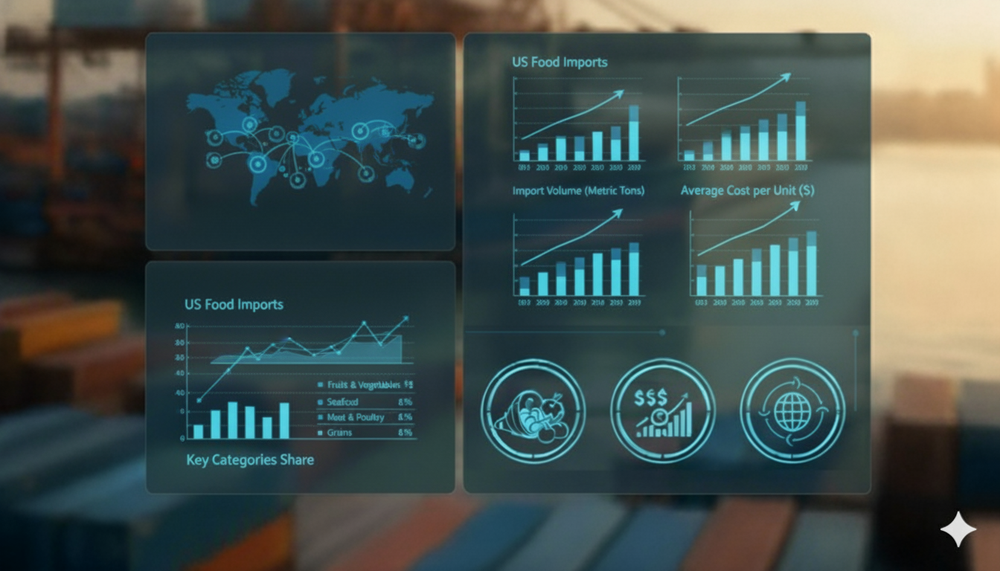
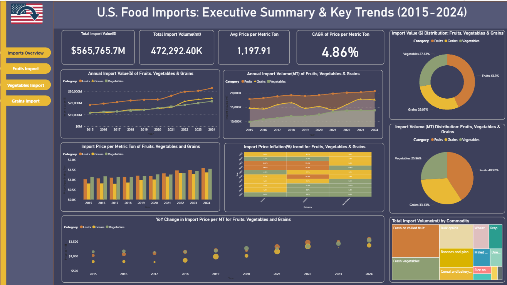
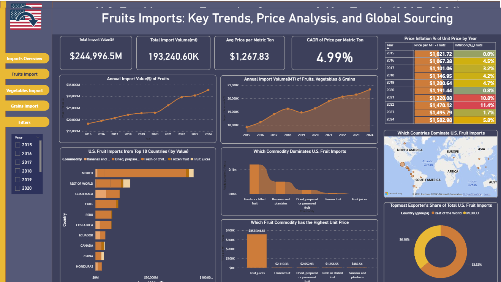
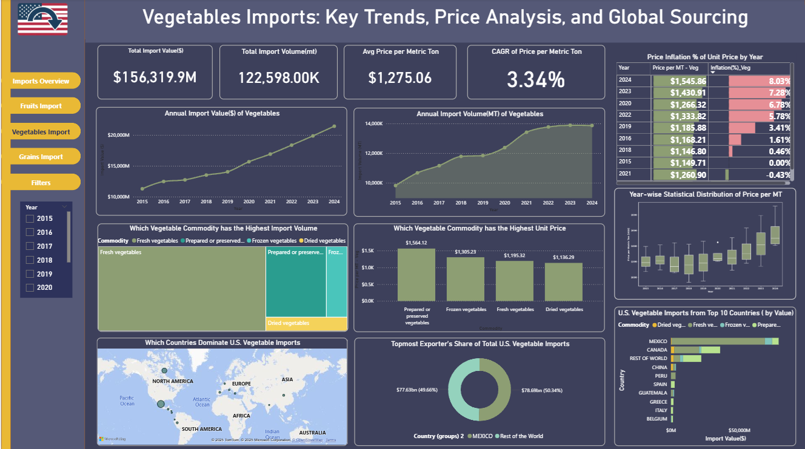
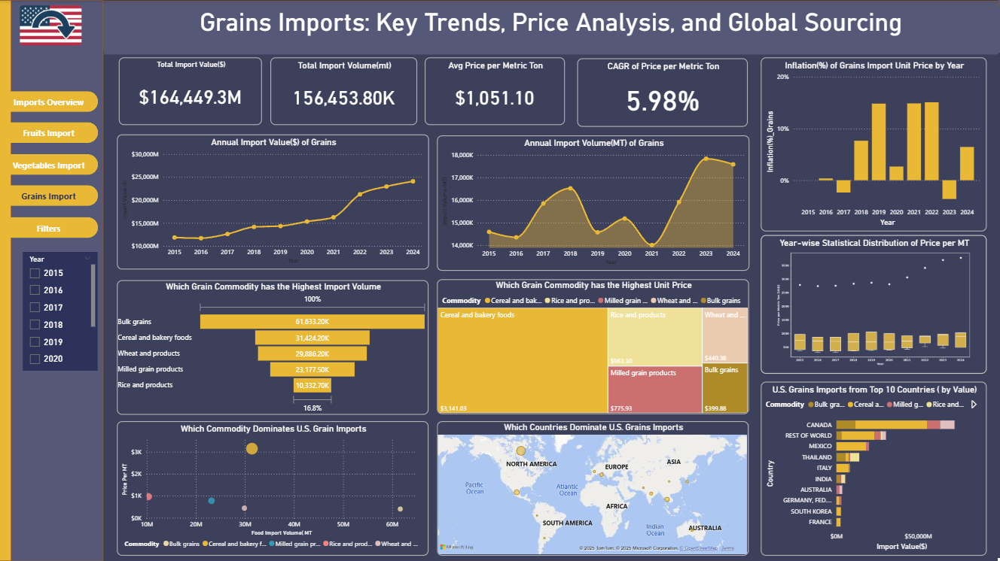

# Capstone Project on Interactive Dashboard with PowerBI
# U.S. FOOD IMPORTS TREND ANALYSIS (2015-2024)

The U.S. Food Imports dataset provides annual data on the value and volume of food and beverage products entering the United States, along with their country of origin.   It captures long-term trends in consumer demand for a growing variety of products including tropical fruits, spices, and imported gourmet foods. With over 20 years of data, the dataset offers a clear lens to explore how U.S. food consumption and trade patterns have evolved over time.

The primary goal of this dashboard is to provide a comprehensive, interactive analysis of U.S. import trends for essential food categories (Fruits, Vegetables, Grains) to inform strategic decisions related to sourcing, pricing, and trade policy.

---
## Data Source
- The data for this dashboard was obtained from open datasets provided by U.S. Department of Agriculture.
- **Citation** : U. S. Department of Agriculture, Economic Research Service. U.S. Food Imports Data.
- **Source** : https://www.ers.usda.gov/data-products/us-food-imports
- **Dataset File type** : FoodImports.csv
- **License** : Public Dataset
---
## Data Cleaning and Preparation ( PowerBI Powerquery)
- **Time Period Used**: Only 10 years of data (2015–2024) were included.
- **Categories Selected**: From the full dataset, only Vegetbales, Fruits and Grains product groups were used in this analysis
  All other product categories were removed.
- **Tables Created**: Two cleaned tables were prepared from the raw dataset.
   - US_FoodImports_Country : Contains country-wise food import data.
   - US_FoodImports_Summary : Provides an overall summary of U.S. food imports.
- **Calculated Measures Created**: Three custom metrics were added:
  - Price per MT
  - Inflation %
  - CAGR
- **Formatting**: Verified column data types (Currency for import value; text for country, commodities, decimal for import volmue) and ensured consistent naming.

## Key Problem Statement
- **Volatility & Cost**: How have the value and volume of key U.S. food imports (fruits, vegetables, grains) changed over the last decade (2015–2024), and what is the impact of price inflation on these essential food items?
- **Source Dependency**: Which countries are the U.S.'s most significant and fastest-growing sources for these food categories, and what is the resulting level of source dependency?

---

## Dashboard Objectives
- **Inflation Impact**: Visualize the trend of Price per MT and Inflation % over the 10-year period to show how import costs have affected U.S. consumers and businesses.
- **Trade Balance**: Identify the overall growth/decline in the total value and volume of food imports across the three categories.
- **Top Contributors**: Pinpoint the top commodity-country combinations that dominate the import landscape for each category.
- **Source Dependency**: Evaluate U.S. reliance on specific countries or regions for essential food items.
- **Trade Decisions**: Enable policymakers, analysts, and trade professionals to use data insights for better sourcing strategies, cost management, and trade diversification.

---

## Dashboard Pages

#### _Key KPIs_
| Total Import Value (US$) | Total Import Volume (MT) | Avg Price per Metric Ton – Calculated Measure | CAGR of Price per Metric Ton – Calculated Measure |
|--------------------------|---------------------------|-----------------------------------------------|---------------------------------------------------|

---

#### _U.S. Food Imports: Executive Summary & Key Trends (2015–2024)_

##### Key Visuals
- Annual Import Value (US$) and Import Volume (MT) of Fruits, Vegetables & Grains (Line Chart)
- Import Value (US$) and Import Volume (MT) Distribution: Fruits, Vegetables & Grains (Donut Chart)
- Import Price per Metric Ton of Fruits, Vegetables and Grains (Bar Chart)
- Import Price Inflation (%) Trend for Fruits, Vegetables & Grains (Python Heatmap)
- YoY Change in Import Price per MT for Fruits, Vegetables and Grains (Scatter Plot)
- Total Import Volume (MT) by Commodity (Tree map)

##### Insights
U.S. food imports grew steadily from 2015 to 2024, totalling $565.8 Billion in value and 472.3 million MT in volume. The average import price per metric ton (MT) increased, resulting in a 4.86% CAGR for import price inflation across the three categories.

#####  Fruits  
High share of both value (43.3%) and volume (40.92%). Consistently command the highest prices per MT with a steadily increasing trend and frequent inflation spikes, positioning them as a premium, high-cost category driven by strong demand.

#####  Vegetables  
Moderate share of value (27.63%) and volume (25.96%). Mid-range and predictable due to gradual price increases and stable inflation. However, they show the highest average price per MT when comparing value to volume, indicating a higher cost per unit for this product mix compared to fruits or grains.

#####  Grains  
Largest share of volume (33.13%) but smallest share of value (29.07%). Imported in bulk at the lowest price per MT. Although long-term price growth is slow, the inflation trend is volatile, with sharp spikes (e.g., 2017, 2021), confirming their role as cost-efficient staples exposed to global market shocks.

---

####   _Fruits Imports: Key Trends, Price Analysis, And Global Sourcing_

#####  Key Visuals
- Annual Import Value (US$) and Import Volume (MT) of Fruits (Line Chart)
- U.S. Fruit Imports from Top 10 Countries by Value (Bar Chart)
- Which Commodity Dominates U.S. Fruit Imports? (Ribbon Chart)
- Which Fruit Commodity has the Highest Unit Price? (Column Chart) 
- Which Countries Dominate U.S. Fruit Imports (Map)
- Topmost Exporter's Share of Total U.S. Fruit Imports (Donut Chart)
- Price Inflation % of Unit Price by Year (Matrix)

#####  Insights
- Price Growth (Highest): Exhibits the strongest price growth with a 4.99% Price per MT CAGR. Price nearly raised up to 50% from $1,021.72 in 2015 to $1,582.98 in 2024.
- Volume & Value: Volume growth is consistent, suggesting demand is not deterred by rising prices.
- Commodity Driver: Volume is dominated by Fresh or chilled fruit. However, Fruit Juices command the highest unit price due to being a value-added, processed product.
- Top Exporter: The U.S. market is critically dependent on Mexico.

---

####  _Vegetables Imports: Key Trends, Price Analysis, And Global Sourcing_

#####  Key Visuals
- Annual Import Value (US$) and Import Volume (MT) of Vegetables (Line Chart)
- U.S. Vegetable Imports from Top 10 Countries by Value (Bar Chart)
- Which Vegetable Commodity has the Highest Import Volume? (Tree Map)
- Which Vegetable Commodity has the Highest Unit Price? (Column Chart) 
- Which Countries Dominate U.S. Vegetable Imports (Map)
- Topmost Exporter's Share of Total U.S. Vegetable Imports (Donut Chart)
- Price Inflation % of Unit Price by Year (Matrix)
- Year-wise Statistical  Distribution of Price per MT (Python Box plot)

#####  Insights
Price Growth (Lowest): Shows the most controlled price increases with the lowest 3.34% Price per MT CAGR. The price per MT rose gradually from $1,077.53 in 2015 to $1,545.86 in 2024, showing resilience to extreme volatility.

- Volume & Value: Characterized by strong, sustained growth in both value and volume over the decade.
- Commodity Driver: Volume is overwhelmingly dominated by Fresh vegetables. Prepared or preserved vegetables command the highest unit price, reflecting the premium for processing.
- Top Exporter: The U.S. relies heavily on Mexico.

---

####  _Grains Imports: Key Trends, Price Analysis, And Global Sourcing_

#####  Key Visuals
- Annual Import Value (US$) and Import Volume (MT) of Grains (Line Chart)
- U.S. Grains Imports from Top 10 Countries by Value (Bar Chart)
- Which Grains Commodity has the Highest Import Volume? (Funnel Chart)
- Which Grains Commodity has the Highest Unit Price? (Tree Map)
- Which Commodity Dominate U.S. Grains Imports (Scatter Plot)
- Which Countries Dominate U.S. Grains Imports (Map)
- Price Inflation % of Unit Price by Year (Matrix)
- Year-wise Statistical  Distribution of Price per MT (Python Box plot)

#####  Insights
- Price Growth (Highest CAGR): Has the highest 5.98% Price per MT CAGR, driven by significant cost pressures (e.g., fuel, fertilizer). Price volatility is high, with a sharp increase from $856.00 in 2018 to $1,334.42 in 2021, driven by 15.1% inflation.
- Volume & Value: Annual import volume shows high volatility (sharp dip 2019–2021, followed by a surge). Bulk grains have the highest import value.
- Commodity Driver: Cereal and bakery foods command the highest unit price ($3,141 per unit), consistent with the premium for highly processed goods.
- Top Exporter: The U.S. market is critically dependent on Canada.

---

## Key Findings/Outcomes

#####  Inflation & Import Cost Volatility
Price per MT and YoY inflation behave differently across categories, revealing distinct risk profiles. Fruits show the highest price levels and the greatest volatility, with frequent sharp inflation swings. Grains, despite being low-cost, also experience occasional large inflation spikes, reflecting sensitivity to global commodity shocks. Vegetables remain comparatively stable, with moderate, consistent inflation trends.

#####  Trade Balance & Import Dominance
The value-to-volume share comparison shows how each category contributes to the overall U.S. import landscape. Fruits account for the largest share of total import value (about 43%), highlighting their role as a high-value category. Grains make up the largest share of total import volume (about 33%), confirming their position as high-volume, cost-efficient staples essential for food security.

#####  Top Contributors (Country Concentration)
Mexico is a leading supplier of fresh fruits and vegetables, while Canada is a major exporter of several grain products. This concentration suggests notable supply-chain exposure to country-specific risks.

#####  Price-Per-Ton Insight
While Fruits have the highest total import value and significant price volatility, Vegetables actually have the highest average price per metric ton, slightly above Fruits. This suggests hidden cost drivers, such as refrigeration, handling, transportation constraints, or a product mix including high-value vegetable varieties.

#####  Predictability vs. Volatility
Inflation stability varies substantially across categories. Vegetables show the most predictable inflation pattern, with moderate and steady changes over time. Fruits are the least predictable due to repeated sharp swings. Grains are usually stable but can experience sudden, disruptive spikes tied to global commodity markets.
